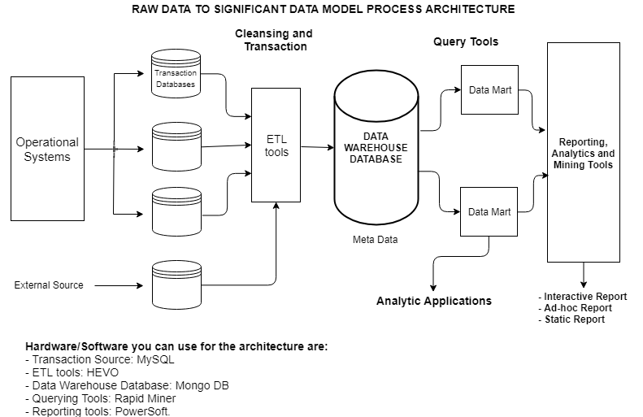

## 1) Bubble sort
```
# Bubble sort works by constantly iterating through an unsorted array 
# and swapping values within that array until such times as no swaps 
# are made within a full pass through the array

def bubbleSort(arr): 
    n = len(arr) # Get the length of the array

    # Loop through all array elements 
    for i in range(n): 
  
        # Last i elements are already in place 
        for j in range(0, n-i-1): 
  
            # traverse the array from 0 to n-i-1 
            # Swap if the element found is greater 
            # than the next element 
            if arr[j] > arr[j+1] : 
                arr[j], arr[j+1] = arr[j+1], arr[j] 

array = [44, 23, 1, 45, 5, 100]
bubbleSort(array)
print (array)
```

## 2) Insertion Sort
```

# Insertion sorting algorithm works by iterating through an array and sorting elements in a linear fashion.
# It can sort an unsorted array in a worst case time of O(N^2) time.
# If the array is already sorted, it has time complexity of O(N) 

def insertionSort(myList):
    
    # loop through every element in the array
    for index in range(1, len(myList)):
        # Get the current value of the element at the current index 'position'
        current = myList[index] 
        position = index

        # Compare the the previous value(s) with the current and swap if greather than current value 

        while position > 0 and myList[position-1] > current:
            # Swap the previous value with the value at index 'position'
            myList[position] = myList[position-1]
            
            # Reduce the position so that we can compare the value at that index against the current value again
            position -= 1
        
        # Let the current value (current) be at the last know position
        myList[position] = current

    return myList

unsortedArray = [4, 22, 100, 2, 3, 4, 2]
sortedArray = insertionSort(unsortedArray)
print(sortedArray)
```

## 3) Looking at the below code, write down the final values of A0, A1, ...An. Answer Explained
>A0 = dict(zip(('a','b','c','d','e'),(1,2,3,4,5)))
>
>A1 = range(10)
>
>A2 = sorted([i for i in A1 if i in A0])
>
>A3 = sorted([A0[s] for s in A0])
>
>A4 = [i for i in A1 if i in A3]
>
>A5 = {i:i*i for i in A1}
>
>A6 = [[i,i*i] for i in A1]


`A0 will output {'a': 1, 'b': 2, 'c': 3, 'd': 4, 'e': 5}`

_The zip returns a tuples of iterators which the dict constructor uses to create a dictionary collection_


`A1 will output [0, 1, 2, 3, 4, 5, 6, 7, 8, 9]`

_The range function creates a list of sequential value from 0 to the less than n (10 - 1 = 9)_

`A2 = [] (empty list)`

_Using Generator to create a list collection. The *if* condition expression make sure that only values from A1 collection that are found in keys of A0 collections are added to the list. No value is found in the A0 collection, so the list is empty and so the sorted function will also return empty list_

`A3 = [1, 2, 3, 4, 5]`

_Using Generator to copy values (not keys) each from the A0 dictionary collection into a new list. The sorted function sorts the list and returns the sorted list as seen above._


`A4 = [1, 2, 3, 4, 5]`

_Using Generator to create a new list collection from A1 list collection (range(10)). The *if* condition ensures that only the values from the A1 list that are found in the A3 list are copied/inserted into the new list._


`A5 = {0: 0, 1: 1, 2: 4, 3: 9, 4: 16, 5: 25, 6: 36, 7: 49, 8: 64, 9: 81}`

_Using Generator to create a new dictionay collection from the A1 list collection. The keys of the dictionary is copied from the values in A1 list and the values of the dictionary are computed by multiplying each of the respective A1 value by itself (i * i) e.g 2 * 2 = 4_


`A6 = [[0, 0], [1, 1], [2, 4], [3, 9], [4, 16], [5, 25], [6, 36], [7, 49], [8, 64], [9, 81]]`

_A Generator is used to copy and create a new list (parent) that contain different list collections (children) from the A1 list. The first value in each list collections (children) in the parent list are the values from the A1 list while the second value in the list collections (children) are the self multiplication of the each respective value in A1 list_

## 4) SQL query to find out how many users inserted more than 1000 but less than 2000 images in their applications!

`SELECT COUNT(*) as total_users FROM (SELECT user_id, COUNT(user_id) as image_count FROM event_log group by user_id HAVING COUNT(user_id) > 1000 and COUNT(user_id) < 2000)`


## 5) Spark code to give date range having maximum no. of visitors using both tables.

```
dateRanges = sc.textFile("hdfs://pathToDateRangeHDFS").toDF()

visitorEvents = sc.textFile("hdfs://pathToVisitorHDFS").toDF()

dateRanges.registerTempTable("dateRanges")

visitorEvent.registerTempTable("events")

spark = SparkSession.builder.master("local") // set your master here
  	     .appName("name")
  	     .getOrCreate()

Result = spark.sql(“SELECT startDate, endDate, MAX(total) as totalVisit from (SELECT COUNT(e.visitors) as total, dr.startDate, dr.endDate FROM EVENTS e inner join dateRange dr where e.eventDate between dr.startDate and dr.endDate group by e.visitors)
```

## 6) Fixing the wrong query
You can not use WHERE keyword with aggregate functions. So the correction will be to use the HAVING keyword after the GROUP BY keyword.

`SELECT subject_code, AVG (marks) FROM students  
GROUP BY subject_code HAVING AVG(marks) > 75`

## 7) Architectural Design Model



> Hardware/Software you can use for the architecture are:
- Transaction Source: MySQL
- ETL tools: HEVO
- Data Warehouse Database: Mongo DB
- Querying Tools: Rapid Miner
- Reporting tools: PowerSoft.

